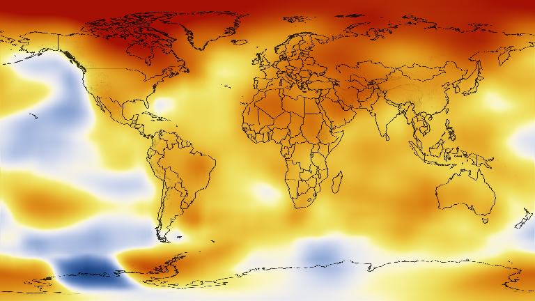
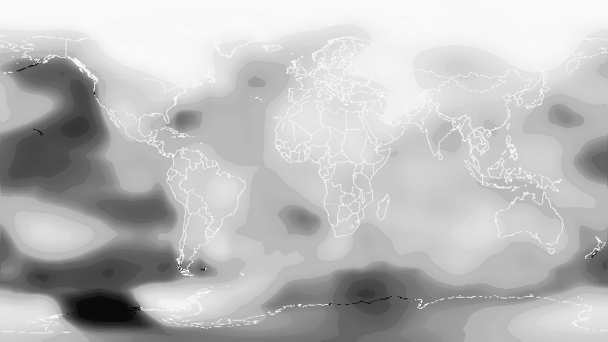
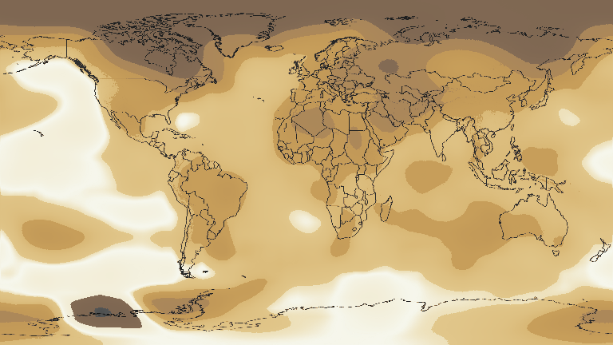

# ColorSchemesInvert
------------------------------
**This repo is deprecated and should not be used.** It only ever existed as an example for a PR to [JuliaGraphics/ColorSchemes.jl](http://github.com/JuliaGraphics/ColorSchemes.jl).

It has been fully merged into ColorSchemes.jl in [JuliaGraphics/ColorSchemes.jl#11](https://github.com/JuliaGraphics/ColorSchemes.jl/pull/11). You can read about how to use this feature, here:
<br>https://juliagraphics.github.io/ColorSchemes.jl/v3/finding

------------------------------

ColorSchemesInvert.jl provides a function, `invert(cscheme, c)`, which is the inverse of `get(cscheme, x)` provided by [JuliaGraphics/ColorSchemes.jl](http://github.com/JuliaGraphics/ColorSchemes.jl).

`invert` places a *color* within a colorscheme, by converting the color to a value representing its position on the colorscheme's axis.


```julia
using ColorSchemesInvert, ColorSchemes, Colors
```


```julia
ColorSchemes.darkrainbow
```


## Examples


```julia
invert(ColorSchemes.darkrainbow, RGB(1,0,0))  # Red
```


    0.9


```julia
invert(ColorSchemes.darkrainbow, RGB(0,1,0))  # Green
```


    0.5484818351995914


```julia
invert(ColorSchemes.darkrainbow, RGB(0,0,1))  # Blue
```


    0.04946640675057849


```julia
invert(ColorSchemes.darkrainbow, ColorSchemes.darkrainbow[2])  # darker blue
```


    0.1


## Motivating Example
One use-case for `invert` is to convert a heat-map image into an Array of continuous values, e.g. temperature.

In this example, we will convert a heat-map style image representing elevation in the United States into an Array of elevations.


```julia
using Images, FileIO
img = download("https://www.nasa.gov/images/content/719282main_2008_2012_printdata.1462.jpg") |> load
img = imresize(img, Tuple(Int(x) for x in size(img).*0.2));
display(img)
```

      % Total    % Received % Xferd  Average Speed   Time    Time     Time  Current
                                     Dload  Upload   Total   Spent    Left  Speed
    100 3011k  100 3011k    0     0  20.1M      0 --:--:-- --:--:-- --:--:-- 12.0M





```julia
ColorSchemes.temperaturemap
```


```julia
temps = [invert(ColorSchemes.temperaturemap, pixel) for pixel in img]
```


    432×768 Array{Float64,2}:
     0.975615  0.975615  0.975615  0.975615  …  0.975615  0.975615  0.975615
     0.975484  0.975767  0.975615  0.975615     0.975615  0.975615  0.975767
     0.975615  0.975615  0.975615  0.975615     0.975615  0.975615  0.975615
     0.975615  0.975615  0.975615  0.975615     0.975615  0.975615  0.975615
     0.975615  0.975615  0.975615  0.975615     0.975615  0.975615  0.975615
     0.975615  0.975615  0.975615  0.975615  …  0.975615  0.975615  0.975615
     0.975615  0.975615  0.975615  0.975615     0.975615  0.975615  0.975615
     0.975615  0.975615  0.975615  0.975615     0.975615  0.975615  0.975615
     0.975615  0.975615  0.975615  0.975615     0.975615  0.975615  0.975615
     0.975615  0.975615  0.975615  0.975615     0.975615  0.975615  0.975615
     0.975615  0.975615  0.975615  0.975615  …  0.975615  0.975615  0.975615
     0.975615  0.975615  0.975615  0.975615     0.975899  0.975899  0.975615
     0.975615  0.975615  0.975615  0.975615     0.975739  0.975739  0.975899
     ⋮                                       ⋱  ⋮                           
     0.84482   0.844684  0.84482   0.821402  …  0.845689  0.846855  0.84482 
     0.823358  0.823887  0.823887  0.823536     0.822783  0.823358  0.823358
     0.822956  0.822359  0.821921  0.82257      0.823536  0.823536  0.823996
     0.821989  0.822677  0.821949  0.821949     0.823141  0.824371  0.822677
     0.820419  0.820084  0.819388  0.819388     0.819977  0.821949  0.81973 
     0.816596  0.816055  0.816055  0.816055  …  0.819388  0.819388  0.818957
     0.813865  0.813247  0.813247  0.813247     0.816055  0.815452  0.813865
     0.810015  0.809307  0.809307  0.809307     0.813247  0.812582  0.812582
     0.808566  0.805171  0.805171  0.805171     0.810015  0.810015  0.809307
     0.804418  0.801045  0.80182   0.801045     0.805171  0.805171  0.805171
     0.801045  0.802513  0.802513  0.800252  …  0.804418  0.804308  0.801045
     0.802037  0.798624  0.798624  0.798624     0.802401  0.800252  0.802848


Now we have converted the data from its original colorscheme to a continuous value, which makes it possible to process as data.

For example, we could find the coldest and warmest places on earth:


```julia
mintemp,maxtemp = ind2sub(temps, indmin(temps)), ind2sub(temps, indmax(temps))
```


    ((397, 127), (17, 314))


Finally, we can display the new, continous values as a grayscale, representing 0 to 1 as black to white:


```julia
Gray.(temps)
```





### convertToScheme
The presence of `invert` makes it easy to convert an image from one colorscheme to another. This package also defines `convertToScheme(cscheme, img)` to do exactly that.

`convertToScheme` will return a new image, where each pixel from the provided image is mapped to its closest matching color in the provided scheme.


```julia
convertToScheme(vcat(ColorSchemes.coffee, RGB(0,0,0)), img)
```





NOTE: I think the "flattening" out of the colors into a few pallete colors is a bug, but I'm not entirely sure. More investigation to do there, I think... :)
